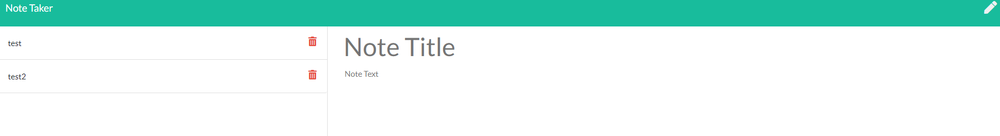

# Note-Taker

A note taking application that reads, writes, and deletes notes from a JSON file to store the inforamtion long term.

# Instructions

Once user is on the home page, click the "Get Started" button to be directed to the notes page. The user can then either create a new note, look at an existing note, or delete and existing note.

# Create a Note

(User must click on the pencil icon in the upper right corner of the screen to create a note if viewing an existing note)

User clicks where the placeholder text says "Note Title". User then types their desired note tilte. Next, the user either can click where the placeholder text says "Note Text" or press the tab key to access the actual note. Once the note title and note text have been typed out, the user clicks on the save icon in the upper right corner. Notes can not be changed once they have been saved. (Save icon will only appear once the note title and note text have something typed in their respective fields.)

# Veiw Existing Note

(Only works if existing notes are in the JSON file)

User clicks on the exiting note title on the left hand side of the screen. The note will then be placed in the center of the screen to be viewed.

# Delete Existing Note

(Only works if existing notes are in the JSON file)

User clicks on the garbace can icon that corresponds with the note that user wants to delete on the left hand side of the screen.

# Screenshots

